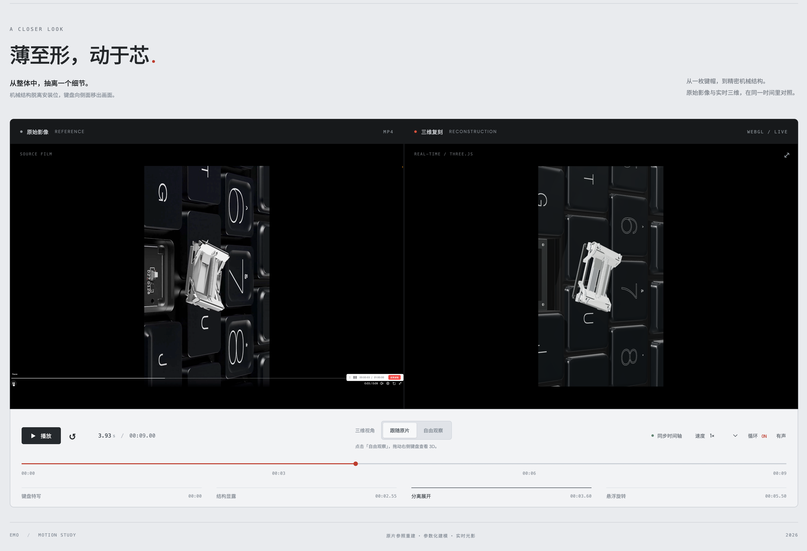

# 键盘3D重建
在 GPT6 Astra Medium 的 /Goal 模式下，通过prompt让模型根据一段“键盘展示视频”重建3D，并且支持与原视频同步播放展示，以及自由拖动键盘体验3D效果。

## **[打开在线 Demo →](https://emo-keyboard-motion.vercel.app/)**

## 是什么

一个使用 Three.js 参照键盘演示录屏重建的交互式 3D Demo。左侧是原始影像，右侧是实时三维画面，通过共用的 **9 秒时间轴**，并排对照键盘特写、键帽抬升、机械结构分离与悬浮旋转。

从黑色键帽到金属框架与弹簧，结合材质、光照和阴影，展示键盘外观及内部结构的运动细节。

## 可以怎么玩

- **同步对比**：播放、暂停或循环，观察原片与 3D 动画的对应变化。
- **细看动作**：拖动时间轴、输入秒数，或切换倍速；点击章节快速定位关键动作。
- **自由观察**：点击「自由观察」，拖动右侧键盘旋转、滚轮缩放；点击「跟随原片」返回同步视角。
- **放大查看**：点击右侧画面的全屏按钮，查看三维细节。

本项目是基于录屏的视觉重建，并非原始模型或动画工程。
